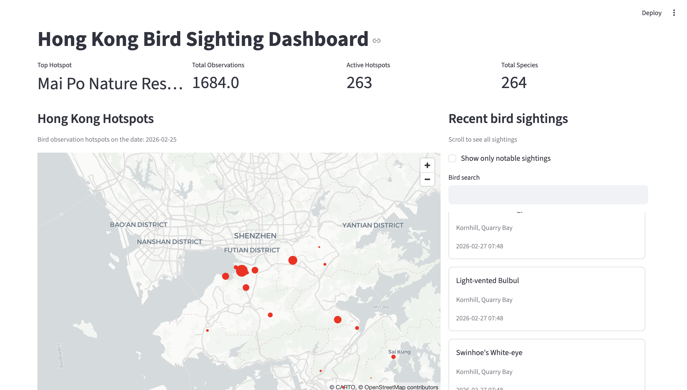

# Hong Kong Bird Sighting Dashboard

This project is a data-driven dashboard for visualizing bird sightings in Hong Kong, built with Streamlit and Python.

## Features

- Fetches real-time bird observation data from the eBird API
- Displays recent sightings, notable sightings, and hotspot locations
- Interactive search and filtering for bird species
- Visualizes hotspots on a map using PyDeck
- CSV fallback for offline testing

## Technologies Used

- Python (Pandas, Requests)
- Streamlit (for web dashboard)
- PyDeck (for map visualization)
- dotenv (for environment variable management)

## How It Works

- The dashboard loads bird sighting data from the eBird API and then cleans the data
- The data is then loaded into streamlit and is used for the charts which include maps, bar chart and search features
- Users can search for specific birds, view metrics, and explore hotspots
- API keys are managed securely via Streamlit secrets or .env files

## Setup

1. Clone the repository
2. Install dependencies: `pip install -r requirements.txt`
3. Add your eBird API key to `.streamlit/secrets.toml` or `.env`
4. Run the app: `streamlit run app.py`
